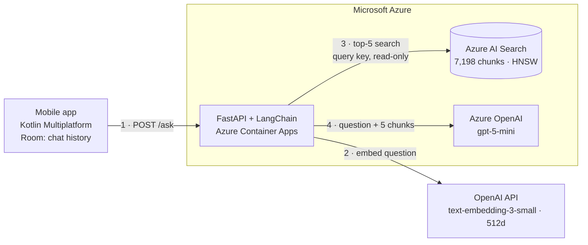
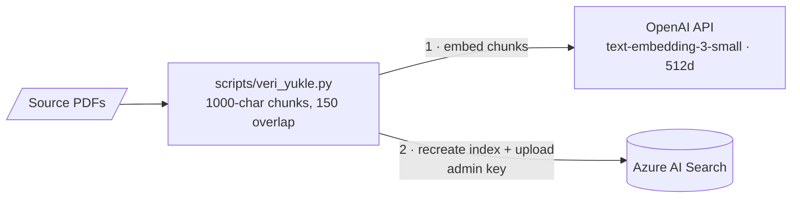
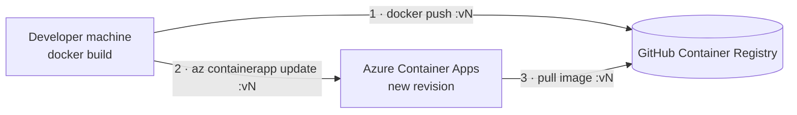

# DUS Assistant: RAG-Based Educational Assistant for Medical Specialization

<p>
  
  
  
  
  
  
  
  
  
</p>

## Abstract

This repository contains the source code for **DUS Assistant**, an academic graduation project developed to address the limitations of Large Language Models (LLMs) in medical education. By implementing a strict Retrieval-Augmented Generation (RAG) architecture, the system provides referenced, factually accurate answers to candidates preparing for the Specialization in Dentistry Examination (DUS), specifically utilizing Periodontology textbooks as the primary knowledge base.

The backend runs in production on **Azure Container Apps**, using **Azure OpenAI** for generation and **Azure AI Search** for vector retrieval, with zero fixed infrastructure cost.

## System Architecture

The project is split into a cross-platform client and a provider-agnostic RAG backend:

* **Mobile client:** Kotlin Multiplatform (KMP) and Compose Multiplatform for a shared codebase across Android and iOS, with Ktor for networking and Room for local chat history.
* **Backend:** FastAPI and LangChain. Each question is embedded, the five most relevant textbook chunks are retrieved, and the LLM answers strictly from those chunks.
* **Production:** a stateless container on Azure Container Apps that scales to zero, backed by managed Azure services.

### Request flow

Arrows point from the caller to the service it calls; responses are omitted.



### Provider-agnostic design

Both the LLM and the vector store sit behind a small interface and a factory. The implementation is chosen at startup by an environment variable, so the same Docker image can run against different services without code changes.

| Variable | Options | Default (production) |
|---|---|---|
| `LLM_PROVIDER` | `azure` (Azure OpenAI, gpt-5-mini) · `claude` (Anthropic, Claude Haiku 4.5) | `azure` |
| `VECTOR_STORE` | `azure_search` (Azure AI Search) · `qdrant` (Qdrant) | `azure_search` |

Adding a new provider means adding one class and registering it in the factory; the RAG chain, the API and the mobile client stay untouched.

### RAG pipeline

| Stage | Details |
|---|---|
| Chunking | Recursive character splitting, 1000 characters with 150 overlap, 7,198 chunks from 4 source documents |
| Embeddings | OpenAI `text-embedding-3-small` (512 dimensions for Azure AI Search, 1536 for Qdrant) |
| Retrieval | Top-5 nearest neighbours, HNSW index on Azure AI Search |
| Generation | System prompt restricts answers to the retrieved context and requires an explicit "not in the sources" reply otherwise |

### Knowledge base ingestion

An offline script builds the index. It uses the same embedding model and dimensions as the API, so stored chunks and incoming questions live in the same vector space.



## Engineering Decisions

* **Fitting the free tier with smaller embeddings.** Azure AI Search's free tier is limited to 50 MB. Using 512-dimensional instead of 1536-dimensional embeddings cut vector storage to a third; in a spot check, 4 of the top-5 retrieved chunks were identical to the 1536-dimensional index.
* **Measuring latency before optimizing it.** Profiling showed ~85% of response time was LLM generation, and that over half of gpt-5-mini's output tokens were hidden reasoning tokens. Setting `reasoning_effort=low` roughly halved generation time while keeping answer detail.
* **Retrying only what can recover.** Rate limits, timeouts and connection errors are retried with exponential backoff; permanent errors (invalid credentials, missing deployment) fail immediately. A misconfiguration now surfaces in ~6 s instead of after six retries and ~50 s of backoff.
* **Least privilege for secrets.** Production receives only the three keys it needs, stored as Container App secrets. The API queries Azure AI Search with a read-only query key; the admin key is used only by the offline ingestion script. No secrets are baked into the image.
* **No internal details in API responses.** Clients receive a generic error message; full exceptions go to the server logs.
* **Zero fixed infrastructure cost.** Free tiers, scale-to-zero, and a public container image (it contains only code, no data or secrets). The trade-off is a cold start of roughly 15-30 seconds after idle periods, covered by a 90-second client timeout.
* **Immutable image tags.** Deployments use versioned tags (`v1`, `v2`, ...) rather than `latest`, so the running version is always known and rollback is a single command.

## Getting Started

### Prerequisites

* Docker Desktop
* Python 3.12 (only for the data ingestion script)
* An OpenAI API key for embeddings, plus credentials for the providers you enable (see [`dus-backend/.env.example`](dus-backend/.env.example))

### 1. Configure

```bash
cd dus-backend
cp .env.example .env
```

Fill in `.env`. By default the backend uses Azure OpenAI and Azure AI Search, the same services as production.

### 2. Load the knowledge base

The source textbooks are **not included** in this repository. Place your own PDF files in `dus-backend/kaynaklar/`, then run:

```bash
python -m venv venv
venv\Scripts\activate          # macOS/Linux: source venv/bin/activate
pip install -r requirements.txt
python -m scripts.veri_yukle
```

The script splits the PDFs into chunks, embeds them, and uploads them to the vector store selected by `VECTOR_STORE`. When the target is Azure AI Search it recreates the index, so it asks for confirmation first.

### 3. Run the backend

```bash
docker compose up -d --build
```

The API is available at `http://localhost:8000` and the interactive docs at `http://localhost:8000/docs`.

To use a local Qdrant instead of Azure AI Search, set `VECTOR_STORE=qdrant` in `.env` and start the optional Qdrant service (its data lives in an external volume, so it survives container removal):

```bash
docker volume create qdrant_storage
docker compose --profile qdrant up -d
```

### 4. Run the mobile app

Open the `DusAssistant/` directory in Android Studio. The backend URL is configured in `shared/src/commonMain/kotlin/com/ilhanaltunbas/dusassistant/data/remote/DusApiClient.kt`.

## Deployment (Azure Container Apps)

Code changes are shipped as a new image version. Container Apps pulls the image itself; the update command only tells it which tag to run.



```bash
docker build -t ghcr.io/<user>/dus-backend:vN dus-backend
docker push ghcr.io/<user>/dus-backend:vN
az containerapp update --name <app> --resource-group <rg> --image ghcr.io/<user>/dus-backend:vN
```

Configuration changes (switching the provider, rotating a key) only need `az containerapp update` or `az containerapp secret set`; no rebuild is required. Rolling back is the same command with the previous tag.

## Project Structure

```
DusAssistant/
├── DusAssistant/                  # Kotlin Multiplatform mobile app
│   ├── androidApp/
│   ├── iosApp/
│   └── shared/                    # shared UI, networking and persistence
└── dus-backend/
    ├── app/                       # runtime code (packaged into the image)
    │   ├── main.py                # FastAPI app, /ask endpoint
    │   ├── rag_motoru.py          # RAG chain, retry policy
    │   ├── providers/             # LLM interface, Azure OpenAI and Claude, factory
    │   └── retrievers/            # Azure AI Search and Qdrant retrievers, factory
    ├── scripts/                   # offline tools (not in the image)
    │   └── veri_yukle.py          # PDF ingestion into the selected vector store
    ├── Dockerfile
    ├── docker-compose.yml
    ├── requirements.txt
    └── .env.example
```

## Application Interfaces

<p align="center">
   
   
   
</p>

## Roadmap

* **Streaming responses** so answers appear token by token instead of after full generation.
* **API protection:** app-level API key and rate limiting, then user authentication and Play Integrity for a public release.
* **Managed identity** instead of API keys for Azure OpenAI and Azure AI Search.
* **Agent layer** with Semantic Kernel for tool calling and query routing.

## Author

**İlhan Altunbaş**
*B.Sc. Computer Engineering*

<p>
  <a href="https://www.linkedin.com/in/ilhanaltunbas/"></a>
  <a href="https://github.com/IlhanAltunbas"></a>
</p>

---
*Developed as a senior graduation project at Çukurova University, Computer Engineering Department.*
