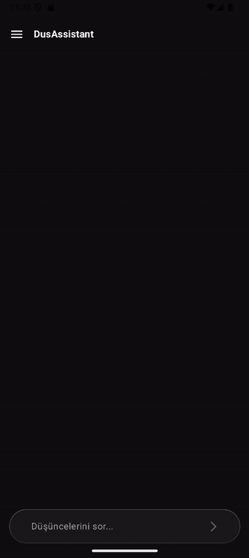
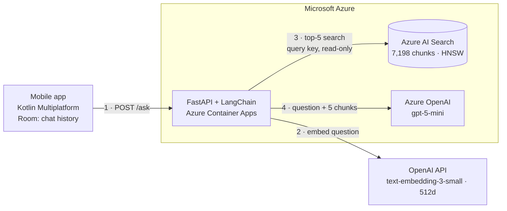
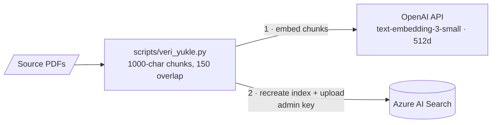
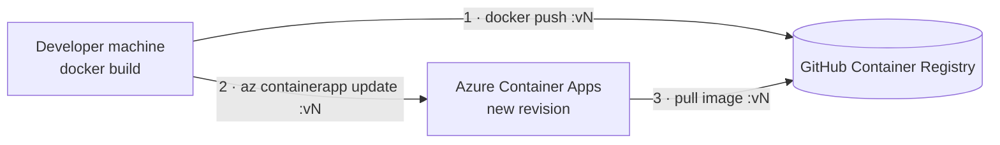

# DUS Assistant: RAG-Based Educational Assistant for Medical Specialization

<p>
  
  
  
  
  
  
  
  
  
</p>

[](https://github.com/IlhanAltunbas/DusAssistant/actions/workflows/backend.yml)
[](https://github.com/IlhanAltunbas/DusAssistant/actions/workflows/mobile.yml)

## Abstract

This repository contains the source code for **DUS Assistant**, an academic graduation project developed to address the limitations of Large Language Models (LLMs) in medical education. By implementing a strict Retrieval-Augmented Generation (RAG) architecture, the system provides referenced, factually accurate answers to candidates preparing for the Specialization in Dentistry Examination (DUS), specifically utilizing Periodontology textbooks as the primary knowledge base.

The backend runs in production on **Azure Container Apps**, using **Azure OpenAI** for generation and **Azure AI Search** for vector retrieval, with zero fixed infrastructure cost.

## Demo

<p align="center">
  
</p>

Recorded against the production backend. The assistant answers from the textbooks, resolves a follow-up question ("which of these...") from the chat history, and declines a question the sources do not cover instead of inventing an answer. It replies in the language of the question (Turkish or English).

## System Architecture

The project is split into a cross-platform client and a provider-agnostic RAG backend:

* **Mobile client:** Kotlin Multiplatform (KMP) and Compose Multiplatform for a shared codebase across Android and iOS, with Ktor for networking and Room for local chat history.
* **Backend:** FastAPI and LangChain. Each question is embedded, the five most relevant textbook chunks are retrieved, and the LLM answers strictly from those chunks.
* **Production:** a stateless container on Azure Container Apps that scales to zero, backed by managed Azure services.

### Request flow

Arrows point from the caller to the service it calls; responses are omitted.



### Provider-agnostic design

Both the LLM and the vector store sit behind a small interface and a factory. The implementation is chosen at startup by an environment variable, so the same Docker image can run against different services without code changes.

| Variable | Options | Default (production) |
|---|---|---|
| `LLM_PROVIDER` | `azure` (Azure OpenAI, gpt-5-mini) · `claude` (Anthropic, Claude Haiku 4.5) | `azure` |
| `VECTOR_STORE` | `azure_search` (Azure AI Search) · `qdrant` (Qdrant) | `azure_search` |

Adding a new provider means adding one class and registering it in the factory; the RAG chain, the API and the mobile client stay untouched.

### RAG pipeline

| Stage | Details |
|---|---|
| Chunking | Recursive character splitting, 1000 characters with 150 overlap, 7,198 chunks from 4 source documents |
| Embeddings | OpenAI `text-embedding-3-small` (512 dimensions for Azure AI Search, 1536 for Qdrant) |
| Query rewriting | Follow-up questions ("which of these is the strongest?") are rewritten into standalone questions from the chat history before retrieval; the first question skips this step |
| Retrieval | Top-5 nearest neighbours, HNSW index on Azure AI Search |
| Generation | System prompt restricts answers to the retrieved context and requires an explicit "not in the sources" reply otherwise; answers in the language of the question (Turkish or English) |

### Knowledge base ingestion

An offline script builds the index. It uses the same embedding model and dimensions as the API, so stored chunks and incoming questions live in the same vector space.



## Engineering Decisions

* **Fitting the free tier with smaller embeddings.** Azure AI Search's free tier is limited to 50 MB. Using 512-dimensional instead of 1536-dimensional embeddings cut vector storage to a third; in a spot check, 4 of the top-5 retrieved chunks were identical to the 1536-dimensional index.
* **Measuring latency before optimizing it.** Profiling showed ~85% of response time was LLM generation, and that over half of gpt-5-mini's output tokens were hidden reasoning tokens. Setting `reasoning_effort=low` roughly halved generation time while keeping answer detail.
* **One retry layer, and only for what can recover.** Rate limits, timeouts, connection and 5xx errors are retried inside the provider SDKs, which retry only the failed call and honour `Retry-After`; permanent errors (invalid credentials, missing deployment) fail immediately. An earlier application-level retry on top of the SDKs multiplied attempts: a load test against a stub returning 429 showed one question producing 12 LLM requests, and each retry also repeated the embedding and search steps. Removing it brought this down to 3.
* **Least privilege for secrets.** Production receives only the three keys it needs, stored as Container App secrets. The API queries Azure AI Search with a read-only query key; the admin key is used only by the offline ingestion script. No secrets are baked into the image.
* **Protecting a public endpoint from cost abuse.** `/ask` requires an app API key (compared in constant time; the API refuses to start without one) and enforces sliding-window rate limits per client IP and globally per day, which caps the worst-case daily LLM bill. The key is checked first so unauthenticated traffic cannot exhaust the quota. Behind the Azure ingress proxy the socket address belongs to the proxy, so the client IP is taken from the rightmost `X-Forwarded-For` entry, the one the proxy appends and the client cannot forge. On the mobile side the key comes from the git-ignored `local.properties` and is masked in HTTP logs.
* **Not blocking the event loop.** The RAG chain is synchronous, so `/ask` is a plain `def` endpoint that FastAPI runs in its thread pool. As an `async def` it had serialised all traffic: a request rejected in 0.01 s waited almost 4 s behind another user's answer.
* **Testing prompt changes repeatedly, not once.** Model output varies between runs, so a prompt that passes a single manual check can still fail in production; one did, refusing most answerable questions. Prompt changes are now checked with each test question asked 16 times against the built container. Asking the model to "answer in the language of the question" still produced Turkish answers to some English questions; detecting the language in code and giving an explicit instruction brought this to 96/96.
* **Per-step latency logging.** Each request logs how long query rewriting, retrieval and generation took (without the question text). This showed retrieval stays under a second while Azure OpenAI latency varies between 2 and 40+ seconds under concurrent load, and that the rewrite step dropped to ~1.3 s once it ran without reasoning.
* **Errors are errors, and reveal no internals.** When the LLM is unavailable `/ask` returns 503 with `Retry-After`, and unexpected failures return 500; both carry a user-facing message in `detail`, while full exceptions go only to the server logs. Returning these messages with 200, as an earlier version did, made the app store them in the chat as assistant answers and send them back to the LLM as history on the next question.
* **Zero fixed infrastructure cost.** Free tiers, scale-to-zero, and a public container image (it contains only code, no data or secrets). The trade-off is a cold start of roughly 15-30 seconds after idle periods, covered by a 90-second client timeout.
* **Immutable image tags.** Deployments use versioned tags (`v1`, `v2`, ...) rather than `latest`, so the running version is always known and rollback is a single command.

## Getting Started

### Prerequisites

* Docker Desktop
* Python 3.12 (only for the data ingestion script)
* An OpenAI API key for embeddings, plus credentials for the providers you enable (see [`dus-backend/.env.example`](dus-backend/.env.example))

### 1. Configure

```bash
cd dus-backend
cp .env.example .env
```

Fill in `.env`. By default the backend uses Azure OpenAI and Azure AI Search, the same services as production.

### 2. Load the knowledge base

The source textbooks are **not included** in this repository. Place your own PDF files in `dus-backend/kaynaklar/`, then run:

```bash
python -m venv venv
venv\Scripts\activate          # macOS/Linux: source venv/bin/activate
pip install -r requirements.txt
python -m scripts.veri_yukle
```

The script splits the PDFs into chunks, embeds them, and uploads them to the vector store selected by `VECTOR_STORE`. When the target is Azure AI Search it recreates the index, so it asks for confirmation first.

### 3. Run the backend

```bash
docker compose up -d --build
```

The API is available at `http://localhost:8000` and the interactive docs at `http://localhost:8000/docs`.

To use a local Qdrant instead of Azure AI Search, set `VECTOR_STORE=qdrant` in `.env` and start the optional Qdrant service (its data lives in an external volume, so it survives container removal):

```bash
docker volume create qdrant_storage
docker compose --profile qdrant up -d
```

### 4. Run the mobile app

Open the `DusAssistant/` directory in Android Studio and add the backend's `APP_API_KEY` to `DusAssistant/local.properties` (git-ignored):

```properties
dus.apiKey=<same value as APP_API_KEY>
```

The build fails with a clear message if it is missing. The backend URL is configured in `shared/src/commonMain/kotlin/com/ilhanaltunbas/dusassistant/data/remote/DusApiClient.kt`.

### 5. Run the tests

```bash
cd dus-backend
pip install -r requirements-dev.txt
ruff check .
pytest
```

The tests replace the LLM and the vector store with stubs and point every Azure endpoint at an unresolvable `.invalid` host, so they need no credentials and cannot reach a paid service. GitHub Actions runs the same checks on every push that touches the backend, then builds the Docker image.

The mobile client's networking layer is tested against Ktor's `MockEngine` (request format, API key header, and how 401/429/503 and non-JSON gateway errors reach the user), from `DusAssistant/` with JDK 17:

```bash
./gradlew :shared:testDebugUnitTest
```

CI provides a placeholder key through the `DUS_API_KEY` environment variable, since `local.properties` is not in the repository.

## Deployment (Azure Container Apps)

Code changes are shipped as a new image version. Container Apps pulls the image itself; the update command only tells it which tag to run.



```bash
docker build -t ghcr.io/<user>/dus-backend:vN dus-backend
docker push ghcr.io/<user>/dus-backend:vN
az containerapp update --name <app> --resource-group <rg> --image ghcr.io/<user>/dus-backend:vN
```

Configuration changes (switching the provider, rotating a key) only need `az containerapp update` or `az containerapp secret set`; no rebuild is required. Rolling back is the same command with the previous tag.

## Project Structure

```
DusAssistant/
├── DusAssistant/                  # Kotlin Multiplatform mobile app
│   ├── androidApp/
│   ├── iosApp/
│   └── shared/                    # shared UI, networking and persistence
└── dus-backend/
    ├── app/                       # runtime code (packaged into the image)
    │   ├── main.py                # FastAPI app, /ask endpoint
    │   ├── rag_motoru.py          # RAG chain, retry policy
    │   ├── providers/             # LLM interface, Azure OpenAI and Claude, factory
    │   └── retrievers/            # Azure AI Search and Qdrant retrievers, factory
    ├── scripts/                   # offline tools (not in the image)
    │   └── veri_yukle.py          # PDF ingestion into the selected vector store
    ├── Dockerfile
    ├── docker-compose.yml
    ├── requirements.txt
    └── .env.example
```

## Application Interfaces

<p align="center">
   
   
   
</p>

## Roadmap

* **Streaming responses** so answers appear token by token instead of after full generation.
* **Per-user protection for a public release:** user authentication and Play Integrity / App Attest, since an app-embedded key can be extracted from the binary.
* **Managed identity** instead of API keys for Azure OpenAI and Azure AI Search.
* **Agent layer** with Semantic Kernel for tool calling and query routing.

## Author

**İlhan Altunbaş**
*B.Sc. Computer Engineering*

<p>
  <a href="https://www.linkedin.com/in/ilhanaltunbas/"></a>
  <a href="https://github.com/IlhanAltunbas"></a>
</p>

---
*Developed as a senior graduation project at Çukurova University, Computer Engineering Department.*
